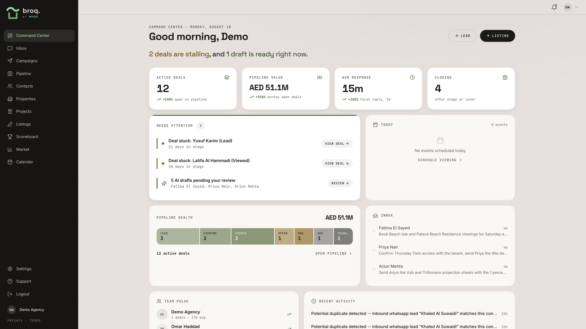
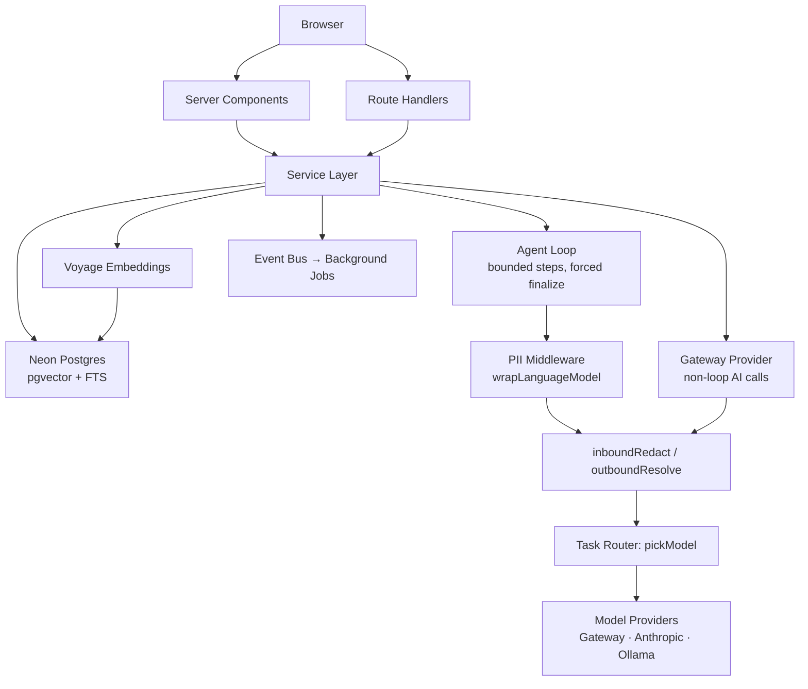
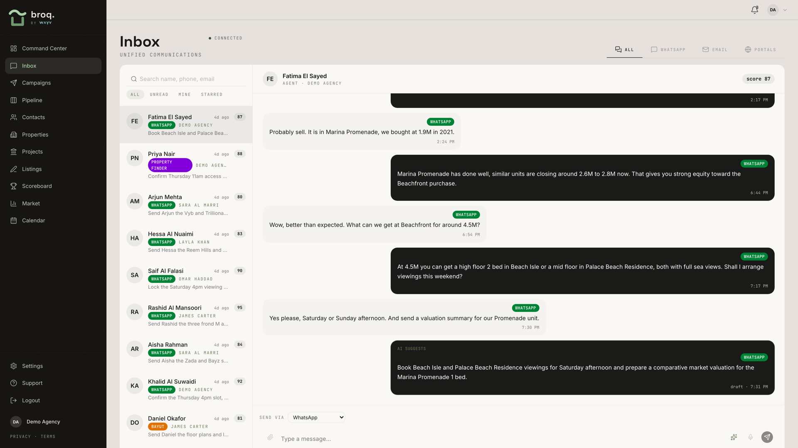
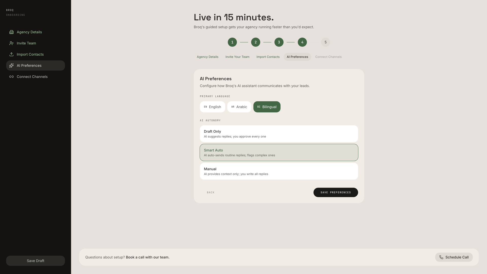
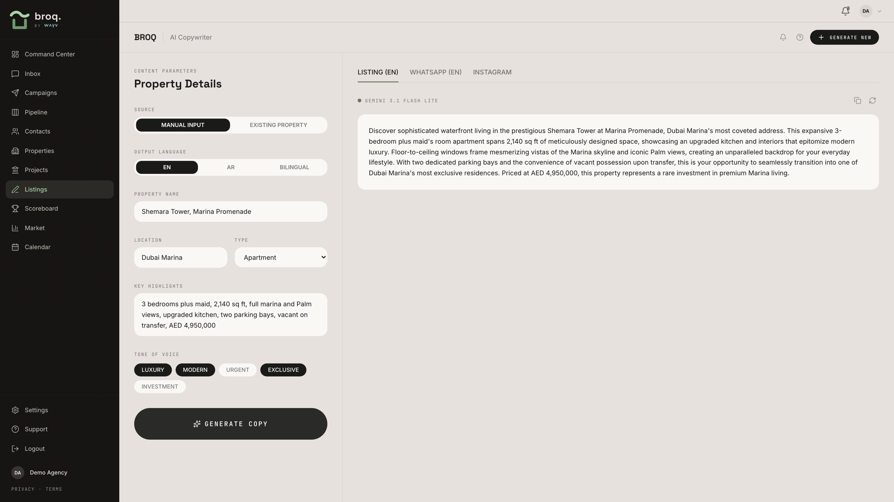
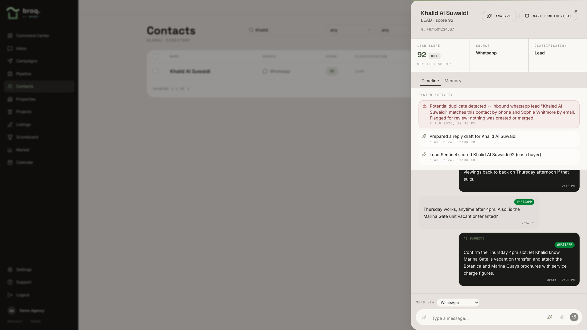
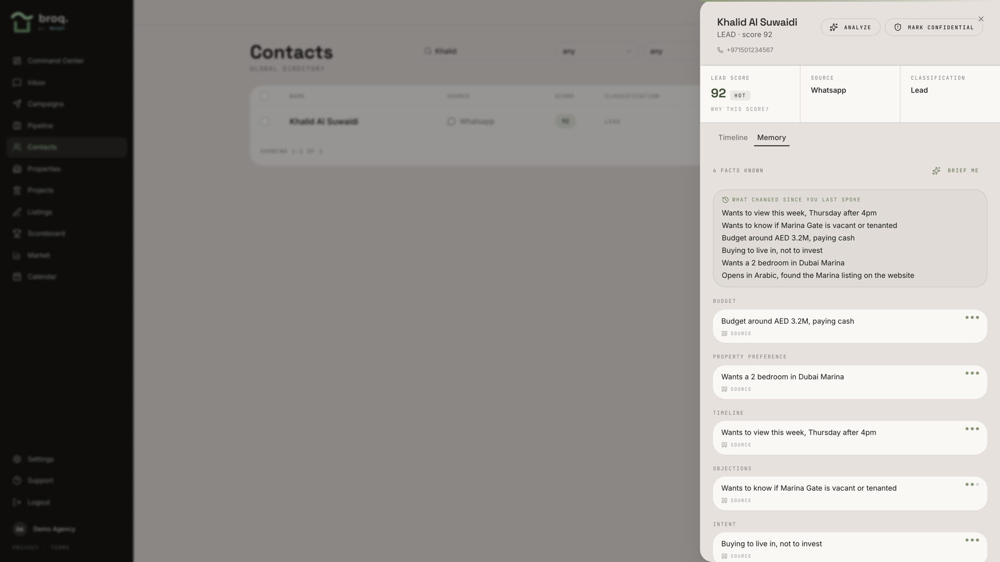
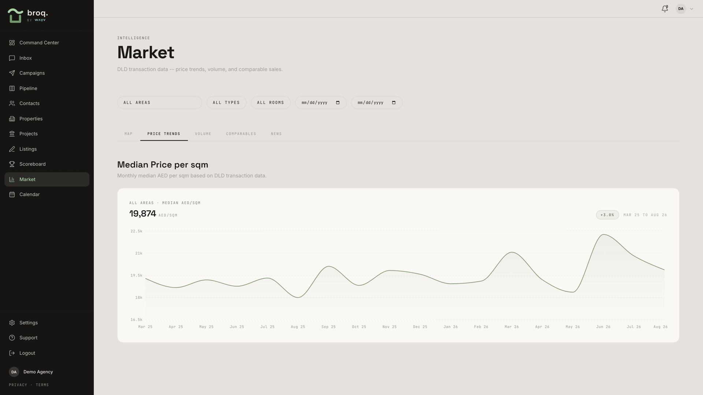
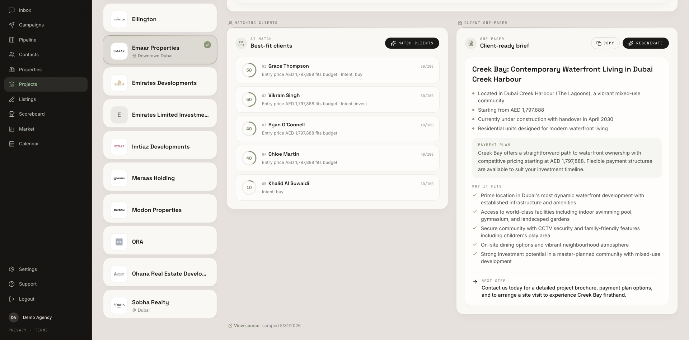
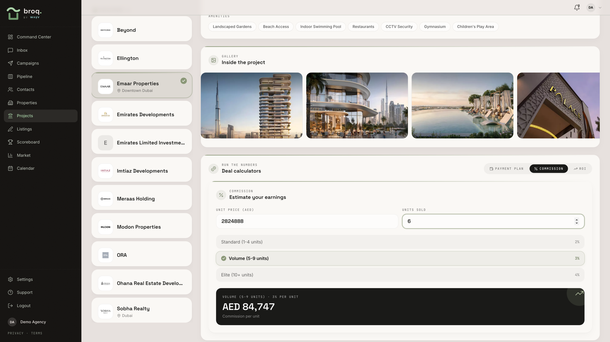

# Broq - Architecture Case Study

Broq is a CRM for boutique real estate agencies in the UAE, built with
multi-tenant isolation, PII-safe AI, and hybrid search at its core.


The product covers the full lifecycle from a first inbound WhatsApp message to a
closed deal: unified inbox across channels, contact records enriched with
AI-extracted facts, property inventory, an off-plan project catalog, deal
pipeline, calendar, campaigns, and market analytics. AI surfaces include reply
drafting, lead scoring, fact extraction, listing copy generation, client-facing
project briefs, and a bounded tool-calling agent that reads only its own
agency's data.



> This repository holds the architecture case study only; the application
> source is private. Code excerpts are illustrative: structure and logic are
> preserved, credentials are stripped. All screenshots show seeded demo data.

**Video walkthroughs:**
[Full walkthrough (5 min)](https://github.com/Nahyan04/broq-architecture/blob/main/assets/video/broq-walkthrough.mp4) ·
[Overview cut (1:44)](https://github.com/Nahyan04/broq-architecture/blob/main/assets/video/broq-overview.mp4)

---

## Tech Stack

| Layer | Technology |
| --- | --- |
| Framework | Next.js (App Router, RSC + Route Handlers) |
| Language | TypeScript end-to-end |
| Database | Neon Serverless Postgres over HTTP, pgvector, full-text search |
| ORM / Migrations | Drizzle ORM (schema-first, generated migrations) |
| Auth | Better Auth with B2B organization multi-tenancy |
| AI SDK | Vercel AI SDK (LanguageModelV3 interface) |
| LLM Routing | Task-typed router → Claude Sonnet 5, Gemini 3.1 Pro / Flash / Flash Lite |
| Embeddings | Voyage `voyage-3-large` (1024-dim, asymmetric) |
| Channels | WhatsApp (Baileys), Gmail (OAuth + Pub/Sub push) |
| Deployment | Vercel |

---

## Architecture



Every path to a language model passes through the same PII redaction layer:
either via middleware on the agent loop, or via the Gateway Provider decorator.
There is no unredacted path.

---

## Key Engineering Decisions

### 1. Tenant Isolation the Model Cannot Bypass

Every tenant-scoped table carries an `agency_id`. The critical part: every AI
tool that touches agency data is produced by a factory that captures `agencyId`
in a closure. The Zod input schema the model sees contains **only task fields**
- the model has no vocabulary to name a tenant, making cross-tenant reads
unrepresentable rather than merely validated against.

```ts
// The model never sees agencyId - it's closed over, not in the schema
export function createFindContactTool(agencyId: string) {
  return tool({
    inputSchema: z.object({ query: z.string().min(2).max(120) }),
    execute: async ({ query }) => {
      const result = await db.execute(sql`
        SELECT id, first_name, last_name, phone, email
        FROM contacts
        WHERE agency_id = ${agencyId}  -- from the closure, not from the model
          AND is_active = true
          AND (first_name || ' ' || last_name) % ${query}
        ORDER BY similarity(...) DESC LIMIT 10
      `);
      // ...
    },
  });
}
```

### 2. PII Redaction Pipeline

Agency inboxes contain Emirates IDs, passport numbers, IBANs, and phone
numbers. Instead of refusing to process them, the gateway redacts on the way in
and resolves on the way out.

- **Identity values** → reversible tokens (`CLIENT_001`, `PHONE_002`, `EID_001`)
- **Monetary amounts** → bracket labels (`AED 1M–5M`) - model-readable, not round-tripped
- **Regex pass order matters** - most specific patterns first (Emirates ID), monetary last to avoid digit overlap

Streaming gets a flush-buffer guard: the last 32 characters are held back so
a token like `PHONE_001` is never split across chunks.



### 3. Hybrid Retrieval in One Round Trip

Listing search needs to handle both `"3br marina sea view"` (keyword) and
`"somewhere quiet near a good school"` (semantic). The challenge: Neon's HTTP
driver makes each call stateless, so index tuning parameters can't be set in a
prior statement.

**Solution:** `SET LOCAL` is transaction-scoped, so it travels in the same
payload as the query. One `db.execute()` carries two `SET LOCAL` statements and
the full CTE query as a single HTTP round trip.

```sql
SET LOCAL hnsw.ef_search = 100;
SET LOCAL hnsw.iterative_scan = 'relaxed_order';
WITH filtered AS (
  SELECT id, embedding, fts FROM properties
  WHERE agency_id = $agencyId  -- tenant filter before either ranker
),
bm25 AS (
  SELECT id, row_number() OVER (...) AS rnk
  FROM filtered WHERE fts @@ tsq LIMIT 50
),
vec AS (
  SELECT id, row_number() OVER (...) AS rnk
  FROM filtered ORDER BY embedding <=> qvec LIMIT 50
),
fused AS (
  SELECT COALESCE(bm25.id, vec.id) AS id,
    (1.0 / (60 + bm25.rnk) + 0.6 / (60 + vec.rnk)) AS rrf_score
  FROM bm25 FULL OUTER JOIN vec USING (id)
)
SELECT * FROM fused ORDER BY rrf_score DESC LIMIT $limit;
```

BM25 weight 1.0 vs vector 0.6 - exact keyword matches win ties. An optional
Cohere rerank runs afterward only when the two rankers disagree on their top
results.

### 4. Bounded Agent Loop

A model allowed to keep calling tools may never stop - or may stop without
producing a structured answer. The loop uses **three bounds** instead of one:

| Bound | Mechanism |
| --- | --- |
| Hard stop | 8 steps or a `finalize` tool call |
| Soft stop | From step 5, or at 50k tokens, narrow tools to `finalize` only |
| Graceful fallback | If `finalize` is never called, capture last prose response |

The model gets one final move to finish on its own terms, instead of being
cut off mid-thought.

```ts
const stream = streamText({
  model: wrapped,  // PII middleware already attached
  tools: input.tools,
  stopWhen: [stepCountIs(8), hasToolCall(FINALIZE_TOOL)],
  prepareStep: ({ stepNumber }) => {
    if (totalTokens >= 50_000 || stepNumber >= 5)
      return { activeTools: [FINALIZE_TOOL] };
    return {};
  },
});
```



### 5. Task-Typed Model Routing

Different AI tasks have different cost/quality profiles. Instead of one default
model, a task type decides which model to use:

```ts
export const MODEL_FOR_TASK: Record<ModelTask, GatewayModelId> = {
  analysis:     'anthropic/claude-sonnet-5',   // lead intelligence
  classify:     'google/gemini-3.5-flash-lite',
  extract:      'google/gemini-3.6-flash',
  draft:        'anthropic/claude-sonnet-5',
  'tool-agent': 'google/gemini-3.6-flash',
  vision:       'google/gemini-3.1-pro',
};
```

Three backends behind one `pickModel(task)` signature - Vercel AI Gateway,
direct Anthropic, and local Ollama for dev - all returning `LanguageModelV3`.
Embeddings are excluded from this router at the type level since they have a
fundamentally different payload shape.



### 6. Cross-Channel Contact Deduplication

Every inbound channel resolves contacts through one `matchOrCreateContact`
function, keyed on normalized E.164 phone and lowercased email with partial
unique indexes. Concurrent-insert losers catch Postgres error `23505` and
re-query to attach to the winner's row. When both keys match different existing
contacts, the system flags a conflict for human review rather than auto-merging
- because a false-positive merge destroys data irreversibly.



---

## Other Notable Mechanisms

**Cold-resume retry** - Neon suspends idle computes. A wrapper on the HTTP
driver's `fetchFunction` retries failed network-level fetches up to 3× with
linear backoff. Resolved HTTP responses (including SQL errors) are never
retried, since those reached Postgres and ran.

**Append-only memory atoms** - Each AI-extracted fact is an immutable row with
the fact text, a 1024-dim embedding, a confidence score, and provenance (source
message ID + quote). Withdrawal means stamping `invalid_at` and linking
`superseded_by` - nothing is ever mutated or deleted.



**Edge bundle safety** - Next.js compiles `instrumentation.ts` for both Node
and Edge runtimes. The WhatsApp connector needs Node builtins (`net`, `zlib`).
Its import lives inside a positive `NEXT_RUNTIME === "nodejs"` check so webpack
tree-shakes the entire module graph out of the Edge bundle. An early-return
guard would *not* tree-shake - the import would leak into the Edge bundle and
break the build. Only `next build` catches this class of bug.

---

## Product Screens

| Screen | Description |
| --- | --- |
|  | **Market Intelligence** - Analytics from global reference data (developer profiles, area stats, transactions) |
|  | **Client Brief** - Deterministic match scoring (budget, area, bedrooms, intent) paired with schema-validated AI-generated project briefs |
|  | **Commission Calculator** - Off-plan commission tiers and payment plans, all tenant-scoped |

---

## Codebase at a Glance

| Measure | Count |
| --- | --- |
| Source lines (incl. tests) | ~78,600 |
| API routes | 78 |
| Domain modules | 16 |
| Database tables | 41 |
| Test files | 107 |
| Migrations | 23 |

---

## Licence

This case study is published under CC BY 4.0. See [LICENSE](LICENSE).
