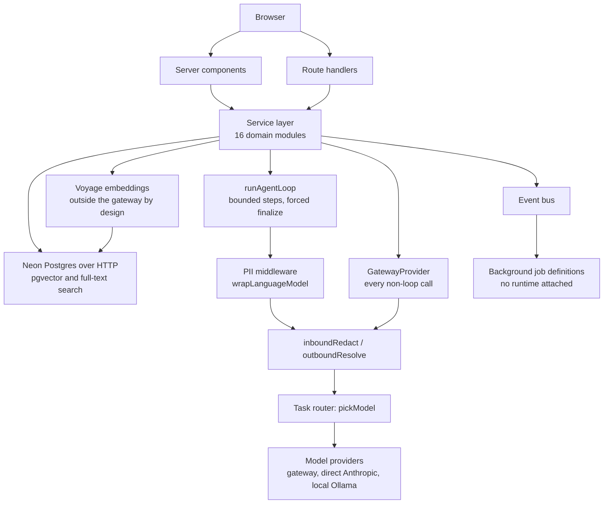

# Broq architecture case study

Broq is a customer relationship manager for boutique real estate agencies in the UAE, built so that
every call to a language model passes through a redaction layer and every AI tool that touches
agency data is bound to a single tenant before the model can name one.


The product covers the work an agency does between a first inbound WhatsApp message and a closed
deal: a unified inbox across channels, contact records with facts extracted from conversation
history, property inventory, an off-plan project catalog, a deal pipeline, calendar, campaigns and
market analytics. The AI surfaces are reply drafting, lead scoring, fact extraction, listing copy,
client-facing project briefs, and a bounded tool-calling agent that reads the agency's own data.


The dashboard home: KPIs, a pipeline summary and recent activity.

This repository holds the case study. The application source is private, so there is no `src/` here,
and the excerpts below are illustrative: structure, types and the interesting logic are preserved,
credentials and identifiers are stripped. There is also no deployed environment. Nothing here
describes traffic, uptime or users, only what the code does. Every screenshot in this document
shows a seeded demonstration tenant, so the names and figures on those screens are demonstration
data rather than real records.

| Measure | Count |
| --- | --- |
| Database tables | 41 |
| Migrations | 23 |
| Architecture decision records | 14 |
| Domain modules | 16 |
| API routes | 78 |
| Test files | 107 |
| Source lines under `src/`, tests included | roughly 78,600 |

The test suite is run by hand as changes are made. [Verification](#verification) covers what that does
and does not include.

Two recordings are committed here. README markdown strips `<video>` elements, so both link out to
their blob page, where GitHub renders a player one click in.

- [Full walkthrough](https://github.com/Nahyan04/broq-architecture/blob/main/assets/video/broq-walkthrough.mp4) (4m57s, ~64MB MP4)
- [Overview cut](https://github.com/Nahyan04/broq-architecture/blob/main/assets/video/broq-overview.mp4) (1m44s, ~19MB MP4)

Jump to [Architecture](#architecture), [the six hard problems](#six-hard-problems),
[smaller mechanisms](#smaller-mechanisms) or [engineering practice](#engineering-practice).

---

## Architecture



78 route handlers sit under `src/app/api` and 16 domain modules under `src/modules`. Every path to a
model reaches it through either the middleware installed on the agent loop or the `GatewayProvider`
decorator, and both funnel into the same pair of redaction functions. Embeddings deliberately do
not: they call Voyage directly, for reasons under
[Task-typed provider routing](#task-typed-provider-routing).

The event bus and the job definitions are typed code with a documented runtime choice (ADR 0008),
but no job runtime is attached, so nothing on that edge executes. The diagram shows the design.

---

## Six hard problems

### Tenancy the model cannot name

Every agency's data shares one database and one set of tables. A tool-calling model that can search
contacts is one persuasive prompt away from reading another agency's book of business, and input
validation is a weak answer, because a well-formed request for the wrong tenant is still well
formed.

Every tenant-scoped table carries an `agency_id`, which is 25 of the 41 tables. One shared helper
mints the column, so a tenant table declares `agencyId: tenantRef()` and inherits NOT NULL plus the
cascade in a single token, and no table gets to spell the tenant reference its own way.

The 16 tables without the column fall into four groups. Seven are Better Auth identity and tenancy
tables, where an agency *is* an `organization` row and `member` and `invitation` scope through
`organization_id`. Two are connector tables keyed on an installation id that reaches the agency in
one hop. Six are global reference tables holding public market and catalog data. The last is the
waitlist, captured before an agency exists to attach it to.

The load-bearing part is narrower than the schema. Every AI tool that touches agency data is produced
by a factory that takes `agencyId` as a plain function argument. The Zod input schema handed to the
model is built at module scope and contains only task fields, so the model has no vocabulary in
which to name a tenant at all. Exposing `agencyId` on the tool schema is the natural way to write
this, and it works, and it becomes a cross-tenant read primitive the moment the model is talked into
emitting a different value. The closure makes that class of attack unrepresentable rather than
merely validated against. Seven of the eight tools are built this way. The eighth is the terminator,
which takes no arguments at all because it reads no tenant data and so needs no tenant binding.

```ts
// src/lib/ai/tools/find-contact.ts

const findContactInputSchema = z.object({
  query: z.string().min(2).max(120),        // the only model-visible field
});

export function createFindContactTool(agencyId: string) {   // closed over, never in the schema
  return tool({
    description: "Search this agency's contacts by free-text name or phone number.",
    inputSchema: findContactInputSchema,
    execute: async ({ query }: FindContactInput): Promise<FindContactHit[]> => {
      const needle = query.trim();
      const result = await db.execute<FindContactRow>(sql`
        SELECT id, first_name, last_name, phone, email,
               GREATEST(similarity((first_name || ' ' || last_name), ${needle}),
                        similarity(COALESCE(phone, ''), ${needle})) AS sim
        FROM contacts
        WHERE agency_id = ${agencyId}       -- from the closure, not from the model
          AND is_active = true
          AND ((first_name || ' ' || last_name) % ${needle} OR COALESCE(phone, '') % ${needle})
        ORDER BY sim DESC
        LIMIT ${LIMIT}
      `);
      // ...
    },
  });
}
```


Market analytics read from the global reference tables, the ones with no `agency_id`. ADR 0016 gives
the reason: the same developer and the same project are identical facts for every agency, and
duplicating them per tenant would mean re-scraping and re-summarizing the same public record once
per customer. The figures on this screen are seeded demonstration data. Real Dubai Land Department
transaction records are token-gated and none are published here.

### Keeping client identifiers out of the model

An agency's inbox is full of Emirates ID numbers, passport numbers, IBANs and phone numbers.
Refusing to process a message that carries one would leave the assistant with nothing to work on, so
the gateway redacts instead of rejecting, and has to put the real values back before a human reads
the reply.

`inboundRedact` runs twelve regex passes in a fixed order, and the order is the correctness
mechanism. Emirates ID goes first because it is the most specific pattern; monetary amounts go last,
because by then the digits no longer overlap anything else. Identity-bearing values become
reversible tokens of the form `KIND_NNN` across six kinds: `CLIENT`, `PHONE`, `EID`, `IBAN`,
`EMAIL`, `PASSPORT`. Honorifics stay outside the token, so `Mr. James Al-Mansoori` redacts to
`Mr. CLIENT_001` and the model keeps the register it needs to write back in.

Money takes a different path: amounts are bucketed, not tokenized. `2400000` becomes the literal
string `AED 1M-5M`. Nothing is stored, no token is minted, and the value does not round-trip. A
bracket label is something the model can reason with, and an opaque token is not, so a budget
survives redaction as a range the model can still work in. Amounts under AED 100,000 are left alone.

```ts
// src/lib/gateway/redact.ts
// Order matters: Emirates ID first (most specific), phones next, monetary last
// because by then the digits no longer overlap another pattern.
export function inboundRedact(text: string, store: TokenStore): string {
  if (!text) return text;
  let out = text;

  out = out.replace(fresh(EMIRATES_ID_DASHED), (m) => store.put(m, "EID"));
  out = out.replace(fresh(EMIRATES_ID_PLAIN),  (m) => store.put(m, "EID"));
  out = out.replace(fresh(UAE_PHONE_INTL),     (m) => store.put(m, "PHONE"));
  out = out.replace(fresh(UAE_MOBILE_LOCAL),   (m) => store.put(m, "PHONE"));
  // ... international phone, IBAN, passport and email passes elided
  out = out.replace(fresh(ARABIC_NAME), (m) => store.put(m.trim(), "CLIENT"));

  // English name preceded by an honorific: keep the honorific, tokenize group 1.
  out = out.replace(fresh(ENGLISH_NAME_WITH_TITLE), (full, nameGroup: string) =>
    full.replace(nameGroup, store.put(nameGroup, "CLIENT")));

  // Monetary bracket replacement. NOT a token: bracket labels are model-readable.
  out = out.replace(fresh(MONETARY_VALUE), (_match, digits: string) => {
    const range = valueToRange(parseInt(digits, 10));
    if (range === null) return _match;      // under AED 100k: left alone
    store.recordMonetary();
    return range;
  });
  return out;
}
```

Repeating a value can collapse to one token, under a precondition that is easy to overstate. The
store keys its reverse map on `` `${kind}:${rawValue}` ``, so reuse requires the two raw regex
matches to be byte-identical, not merely to be the same phone number. Run the pipeline over
`call 050 123 4567 then call 050 123 4567` and both occurrences come back as `PHONE_001`, because
the local-format pattern ends on a word boundary. Run it over the same number in `+971` form,
written twice with a space after the first and a full stop after the second, and it comes back as
`PHONE_001` and `PHONE_002`: the international pattern ends in an optional separator, which swallows
that trailing space into the first match, leaving two raw matches that differ by one byte. Same
number, two tokens. Resolution still restores both correctly, so the cost is a model that thinks it
saw two people.

Two seams carry the pipeline, split by call shape. The agent loop wraps its model with AI SDK
middleware that redacts in `transformParams` and resolves in `wrapGenerate` and `wrapStream`, so a
caller cannot obtain the wrapped model without the redaction attached. Every non-loop call reaches
the model through the `GatewayProvider` decorator, which calls the same two functions around the
provider interface. There is no third path. Raw model construction happens exactly once, inside
`pickModel`, which has four call sites: three inside the routing provider's own methods, and one in
the agent loop where the next statement wraps it. The routing provider itself is constructed once in
the codebase, on the same line that wraps it in `GatewayProvider`. What holds that shut is one
construction site each, not a type or a lint rule that would stop someone adding a third.

Streaming needs one extra guard. A token like `PHONE_001` can be split across two `text-delta`
chunks, and a resolver that runs per chunk would miss it. The transform accumulates deltas and
flushes only `pending.length - 32` characters, holding back the last 32 permanently until more text
arrives; since the longest possible token is well under 32 characters, no flush can bisect one. The
remainder drains on `text-end` and again in `flush()`, so nothing is lost at close.

Gateway calls write an audit row into a per-agency HMAC-SHA256 chain, where each row's hash covers
the agency key, the previous hash, an HMAC of the payload and the timestamp. The raw payload is
hashed, never persisted. Two caveats belong with that claim. The chain is optimistic and can fork
under concurrent writers for the same agency, which the code says in a comment. The secret also
falls back to a development placeholder when the environment variable is unset or shorter than 32
characters. Tamper-evident by construction is the accurate description of it.


The unified inbox with a generated reply open. Thread content reaches the model through the pipeline
above: tokens on the way in, real values restored on the way back, so the draft an agent reads is in
plain language while the transcript the model saw was not.

### Hybrid retrieval in one round trip

Listing search has to answer both "3br marina sea view" and "somewhere quiet for a family near a
good school" over one agency's inventory. Keyword search handles the first, vector search handles
the second, and the two result sets have to be fused into one ranking. The awkward part is the
database driver: the app connects to Neon over HTTP, where each call is an independent stateless
request, so there is no session on which to set index tuning parameters ahead of time. A `SET`
issued in its own call lands in a different implicit transaction and is gone before the query runs.

The answer is `SET LOCAL`, which is transaction-scoped and therefore has to travel in the same
payload as the query it tunes. One `db.execute()` carries two `SET LOCAL` statements and the CTE
query as a single HTTP round trip. "One statement" would be the wrong description, since three
statements go over the wire. One round trip is the property that matters, and the driver forces it.

The tenant filter is applied once, in the `filtered` CTE, before either ranker runs. Both the BM25
and the vector CTEs select from `filtered`, so there is no path on which a row from another tenant
is retrieved and then discarded. Each side produces a rank capped at 50, and the two are combined by
weighted reciprocal rank fusion over a full outer join, so a document that only one ranker found
still scores. BM25 carries weight 1.0 against the vector side's 0.6, which means exact keyword
matches win ties. An optional Cohere rerank runs afterwards in TypeScript and is skipped when the
two rankers already agree on their top three, since a rerank that cannot change the order is not
worth paying for.

```sql
-- src/server/retrieval/hybridSearchListings.ts, inside one db.execute()
SET LOCAL hnsw.ef_search = 100;
SET LOCAL hnsw.iterative_scan = 'relaxed_order';
WITH q AS (
  SELECT websearch_to_tsquery('english', unaccent($query::text)) AS tsq, $qvec::vector(1024) AS qvec
),
filtered AS (                    -- tenant boundary applied once, before both rankers
  SELECT id, embedding, fts FROM properties, q
  WHERE agency_id = $agencyId
    -- ... optional price, bedroom and location facets elided
),
bm25 AS (
  SELECT id, row_number() OVER (ORDER BY ts_rank_cd(fts, q.tsq) DESC) AS rnk
  FROM filtered, q WHERE fts @@ q.tsq LIMIT 50
),
vec AS (
  SELECT id, row_number() OVER (ORDER BY embedding <=> q.qvec) AS rnk
  FROM filtered, q WHERE embedding IS NOT NULL ORDER BY embedding <=> q.qvec LIMIT 50
),
fused AS (
  SELECT COALESCE(bm25.id, vec.id) AS id,
         (1.0 * COALESCE(1.0 / (60 + bm25.rnk), 0)
        + 0.6 * COALESCE(1.0 / (60 + vec.rnk),  0)) AS rrf_score
  FROM bm25 FULL OUTER JOIN vec USING (id)
)
SELECT f.id, p.title, f.rrf_score FROM fused f
JOIN properties p ON p.id = f.id ORDER BY f.rrf_score DESC LIMIT $limit;
```

The query vector is embedded first, through Voyage `voyage-3-large` at 1024 dimensions with
`inputType: 'query'`, because Voyage embeddings are asymmetric between documents and queries.

### The agent loop and its two bookkeepers

A model allowed to keep calling tools will sometimes not stop, and will sometimes stop without
producing the structured answer the caller needed. Cutting it off at a step limit handles the first
failure and makes the second worse, because the caller is left with a truncated transcript and no
result.

The loop uses three bounds instead of one. `stopWhen` is the hard stop, at eight steps or a
`finalize` tool call. The soft stop is the interesting one: from step five, or once cumulative
tokens cross 50,000, `prepareStep` narrows the tool set to `finalize` alone. The model keeps its
turn and has one move left, so it finishes on its own instead of being cut off mid-thought.

If it still never calls the terminator, the loop does not throw. The result carries `terminatedBy`
as `finalize`, `step_cap` or `token_cap`, and only upgrades to `finalize` when a tool call actually
parses against the terminator's schema. The designed cushion for the other two cases is a separate
`text` field holding the last non-empty assistant message. Smaller models routinely answer in prose
instead of calling the terminator, and a caller holding prose is better off than a caller holding
`null`.

```ts
// src/lib/ai/agent-loop.ts
const STEP_LIMIT = 8;
const STEP_FORCE_FINALIZE_AFTER = 5;
const TOKEN_CAP = 50_000;

await runWithLoopContext(ctx, async () => {         // marks "a loop owns this context"
  const stream = streamText({
    model: wrapped,                                 // PII middleware already attached
    tools: input.tools,
    stopWhen: [stepCountIs(STEP_LIMIT), hasToolCall(FINALIZE_TOOL)],
    prepareStep: ({ stepNumber }) => {
      const tokenCapHit = totalTokens >= TOKEN_CAP;
      const stepCapHit = stepNumber >= STEP_FORCE_FINALIZE_AFTER;
      if (tokenCapHit || stepCapHit) return { activeTools: [FINALIZE_TOOL] };
      return {};
    },
    onStepFinish: async (step) => {
      await writeInteractionRow({ /* one ai_interactions row per step */ });
    },
  });
  await stream.consumeStream();   // drain, or onStepFinish and stopWhen never fire
});
```

The `AsyncLocalStorage` wrapper solves a duplicate that has no parameter to thread. Two layers write
to `ai_interactions`: the loop writes one row per step, and `GatewayProvider` writes one row per
call it wraps. A tool that itself calls the provider runs inside the loop's async context, so one
logical step produces two rows. The loop cannot pass a flag down, because the loop never calls the
provider; the model calls a tool, and the tool calls the provider several frames down a stack the
loop does not see. Running the whole stream inside `runWithLoopContext` lets the provider ask
whether a loop owns the current context and skip its own insert.

```ts
// src/lib/ai/gateway.ts, the other half of the contract
private async recordAudit(args: { /* ... */ }): Promise<void> {
  // A loop active on this async context owns the per-step ai_interactions
  // write, so skip here rather than double-inserting.
  if (!getActiveLoopContext()) {
    await db.insert(aiInteractions).values({ /* ... */ });
  }
  // The audit chain sits outside the guard and is never suppressed.
  await writeAuditEntry({ /* ... */ });
}
```

The suppression is deliberately narrow. Only the cost-telemetry insert is skipped, and the
audit-chain write stays outside the guard. Wrapping the whole method in that condition is the
obvious refactor, and it would quietly punch a hole in the compliance record to fix a telemetry
duplicate.


Onboarding captures an autonomy level and a language preference per agency. The loop itself returns
a result object with a draft reply, a confidence value and its reasoning. Sending is a separate code
path; the loop is not where it happens.

### Task-typed provider routing

Model choice is not one decision. Deciding whether a message mentions a meeting and drafting a reply
a client will read have different cost and quality profiles, so a single default model either
overpays on the cheap task or underserves the expensive one. Vendors move as well, and a model can
be dated for shutdown long before the feature that calls it is finished.

The task type decides, not the call site. Seven task types exist and six of them route to a model.
Lead intelligence routes to Claude Haiku 4.5; classification, extraction, drafting, tool use and
vision route to Gemini 3.1 Flash Lite. Three back ends live behind the same `pickModel` signature
and are selected by one environment variable: the Vercel AI Gateway, a direct Anthropic key path,
and local Ollama for development. All three return a `LanguageModelV3`, so the redaction middleware
and the agent loop are untouched by the choice.

`embed` is the seventh task and it is excluded from the map by the type system, not by convention:
the record is typed over `Exclude<ModelTask, 'embed'>`, so adding a row for it fails to compile.
Embedding payloads have a different shape from text generation, an input array and an output
dimension and dtype, and wrapping Voyage as a fake `LanguageModelV3` would be a leaky abstraction
paid for at every call site. The task name exists in the union anyway so the router's public shape
does not change if that decision is ever revisited. The accepted cost is one parallel auth path and
one parallel telemetry path, recorded in ADR 0010.

```ts
// src/lib/ai/router.ts
// Ollama is a development-only swap. A misconfigured production build
// hard-fails at module load, which is import time rather than first call.
if (process.env.NODE_ENV === 'production' && process.env.AI_PROVIDER === 'ollama') {
  throw new Error(
    'AI_PROVIDER=ollama is a dev-only setting and cannot run in production. ' +
      'Unset AI_PROVIDER or set AI_PROVIDER=gateway.',
  );
}

export type ModelTask =
  | 'analysis' | 'classify' | 'draft' | 'tool-agent' | 'extract' | 'vision' | 'embed';

// `embed` is excluded at the type level, not by convention.
export const MODEL_FOR_TASK: Record<Exclude<ModelTask, 'embed'>, GatewayModelId> = {
  analysis: 'anthropic/claude-haiku-4-5',      // lead intelligence only
  classify: 'google/gemini-3.1-flash-lite',    // meeting detection + default
  extract:  'google/gemini-3.1-flash-lite',
  draft:    'google/gemini-3.1-flash-lite',
  'tool-agent': 'google/gemini-3.1-flash-lite',
  vision:   'google/gemini-3.1-flash-lite',
};

export function pickModel(task: ModelTask): LanguageModelV3 {
  if (task === 'embed') throw new Error(/* ... embeddings go direct to Voyage */);
  if (isAnthropicActive()) return pickAnthropicModel();
  if (isOllamaActive()) {
    if (task === 'vision') throw new Error(/* ... vision is not served by local Ollama */);
    return pickOllamaModel(task);
  }
  return gateway(MODEL_FOR_TASK[task]);
}
```

The guard at the top sits at module scope, so it fires on import. Both conditions are required:
Ollama in development is fine and the gateway in production is fine, and only the combination
throws. Because `NODE_ENV` is `production` during `next build`, this is a build-time guard as much
as a boot-time one, which is why a production build has to be run with the gateway provider set.


Listing copy generation. The model chip names the routing target for the `draft` task; it is not a
claim about which provider produced the text on screen, since this session ran against a different
back end. What the chip demonstrates is that the task chooses the model, and the call site does not
know or care which one it got.

### The Edge bundle trap

`register()` in `src/instrumentation.ts` boots the WhatsApp connector runtime once per server
process, in development. Next.js compiles that one source file twice, once for the Node runtime and
once for the Edge runtime, and the connector's module graph needs Node builtins such as `net` and
`zlib` that the Edge runtime does not provide. The import has to disappear from the Edge compilation
entirely, not merely go unexecuted there.

It disappears because `NEXT_RUNTIME` is replaced with a string literal per compilation. In the Edge
build, `if (process.env.NEXT_RUNTIME === "nodejs")` becomes `if ("edge" === "nodejs")`, a statically
false branch, and webpack eliminates the branch along with everything lexically inside it, the
dynamic import and its whole module graph included. The guard has to stay a positive nested check
for that to happen.

Rewriting it as an early return is the trap. `if (process.env.NEXT_RUNTIME !== "nodejs") return;`
followed by a top-level `await import(...)` is behaviourally identical at runtime and reads better.
It also does not tree-shake, because the import is no longer inside a statically false block.
Webpack keeps it, the connector graph is pulled into the Edge bundle, and the build fails on missing
Node builtins.

The two spellings are indistinguishable to the type checker, so `tsc --noEmit` stays silent, and
vitest never performs an Edge compilation, so the unit suite cannot see it either. Only a full
`next build` surfaces the difference. That is the whole category: correct TypeScript, correct
runtime semantics, broken bundle, and a build is the only check that catches it.

```ts
// src/instrumentation.ts
export async function register(): Promise<void> {
  if (process.env.NEXT_RUNTIME === "nodejs") await import("./sentry.server.config");
  if (process.env.NEXT_RUNTIME === "edge")   await import("./sentry.edge.config");

  if (process.env.NODE_ENV === "production") return;   // dev-only gate, NOT the runtime check

  // The dynamic import lives lexically inside a positive NEXT_RUNTIME==='nodejs'
  // check so webpack tree-shakes the whole connector-runtime chain out of the
  // Edge instrumentation bundle (NEXT_RUNTIME is replaced with a literal per
  // compilation). An early-return guard would NOT eliminate the dynamic import,
  // dragging the Baileys + AI graph -- which require Node builtins like `net`
  // and `zlib` -- into the Edge bundle and breaking the build.
  if (process.env.NEXT_RUNTIME === "nodejs") {
    try {
      const { bootActiveBaileysInstalls } = await import(
        "@/lib/connectors/whatsapp-baileys/runtime"
      );
      await bootActiveBaileysInstalls();
    } catch (err) {
      console.error("[instrumentation] Baileys boot-on-start failed",
        err instanceof Error ? err.message : err);
    }
  }
}
```

The `NODE_ENV` early return two lines above is a different check with a different job, gating the
connector boot to development. Reading it as the runtime guard inverts the point of the example.

---

## Smaller mechanisms

### Cold-resume retry

Neon suspends an idle compute, and the first query against a waking one can fail at the network
level, which the HTTP driver surfaces as a hard error with no retry of its own. A wrapper installed
on `neonConfig.fetchFunction` tries a thrown `fetch` up to three times with linear backoff, so a
cold start costs a sub-second delay instead of a 500. A resolved HTTP response is never retried,
whatever it says: a SQL error, whether a syntax error or a constraint violation, comes back
resolved with an error body, which means the statement reached Postgres and ran. Replaying a
non-idempotent write on that basis would re-attempt a mutation the database has already processed.
Because the hook is installed on the driver config and not at a call site, it covers every query in
the app, session lookups included.

### Cross-channel deduplication

Every inbound channel resolves contacts through one `matchOrCreateContact` entry point, keyed on a
normalized E.164 phone and a lowercased email and backed by partial unique indexes on
`(agency_id, phone_e164)` and `(agency_id, email_lower)`; a concurrent-insert loser catches Postgres
`23505` and re-queries to attach to the winner's row. When
both keys match and they match two different contacts, the service writes no contact row at all: it
logs a note on each of the two existing contacts naming the other, requests an owner notification,
and returns the phone match flagged as a conflict. ADR 0017 records why it stopped materializing a
third contact there: an unresolvable identity conflict is a review task, not a new person, and the
third row violated a partial unique index by its own precondition anyway.


A contact sheet with its score, classification and duplicate flag. Conflicts surface for review, and
the service never auto-merges.

### Append-only memory atoms

Each extracted fact is one immutable row carrying the fact text, a 1024-dimension embedding, a
category, a confidence value, and provenance as the source message id plus the quote it came from,
so any claim on screen traces back to the message that produced it. Withdrawing a fact means
stamping `invalid_at` and pointing `superseded_by` at the atom that replaced it. The original row is
never mutated and never deleted, so a live read is a filter on
`invalid_at IS NULL` and the record of what was believed, and when, stays queryable.


The Memory tab: facts accumulated about a contact across conversations.

---

## Engineering practice

### Architecture decision records

14 records in `docs/adr/`. Numbering is not contiguous: the files present are 0001-0003 and
0007-0017.

| ADR | Decision |
| --- | --- |
| 0001 authentication and multi-tenancy | Better Auth with the organization plugin over NextAuth, Clerk and Supabase, because B2B organization multi-tenancy was needed without buying into a vendor's database platform. |
| 0002 modular monolith | Code partitions into `src/modules/<domain>/` instead of splitting into services, which keeps a growing codebase domain-partitioned inside one deployable. |
| 0003 vendor-agnostic AI adapter | An `AIProvider` interface replaces direct SDK calls in routes, so vendors swap without touching feature code and there is one enforcement point for limits, logging and data classification. LangChain and LlamaIndex rejected as overweight. |
| 0007 PDF rendering | `@react-pdf/renderer` over headless Chromium, because listing PDFs are structured data rather than a web-page replica and a ~300MB browser binary would force a sidecar. Third-party PDF APIs rejected on data privacy. |
| 0008 Inngest background runtime | A durable job runtime replaces an in-process bus over Next's `after()`, which had no retries, schedules, replay or observability, and multi-second model workloads must survive a function timeout. |
| 0009 task-typed provider routing | `pickModel(task)` maps a task type to a model, so cheap classification and premium drafting stop sharing one model. Also motivated by a dated model shutdown. |
| 0010 pgvector hybrid retrieval | pgvector on Neon plus BM25 fused with RRF, rejecting a dedicated vector database at boutique scale, and calling Voyage directly because embedding payloads do not fit a text-in text-out gateway. |
| 0011 Gmail over IMAP | Gmail via OAuth and Pub/Sub push, chosen over generic IMAP/SMTP for threading fidelity and deliverability through the agency's own mailbox. A relay address was rejected as breaking agent-to-contact provenance. |
| 0012 cross-channel contact dedup | One shared `matchOrCreateContact` on normalized keys backed by partial unique indexes. Fuzzy probabilistic merging rejected, because a false-positive merge destroys data irreversibly. |
| 0013 Gmail Pub/Sub topic model | One shared topic for all tenants, routed at ingress by a SQL lookup on the install's stamped address, because boutique agencies do not own a cloud project to provision a topic in. |
| 0014 busy-time storage | Pulled external calendar busy windows get their own table instead of a `source` discriminator on `calendar_events`, which keeps a growing external time-series out of the agent-facing meeting table. |
| 0015 Python scraper on shared Neon | The scraper stays Python for a stealth fetcher with no TypeScript equivalent, and integrates through the shared database rather than a queue, with the schema staying Drizzle-owned and the scraper restricted to idempotent upserts. |
| 0016 catalog versus inventory, and grounded AI | Public reference data lives in global catalog tables adopted into tenant inventory by an explicit track action. Because these screens are shown to clients, the client match is a deterministic scoring function and the one-pager is schema-validated generation constrained to supplied facts. |
| 0017 duplicate conflicts are flagged | Amends 0012: the conflict branch writes no third contact, logs an activity on both existing contacts and returns the phone match. |


Two mechanisms on one screen, and ADR 0016 keeps them apart. The ranked matches in the middle column
come from a deterministic scoring function with fixed weights for budget, area, bedrooms and intent,
reading `contact_intelligence` fields that an upstream AI pipeline extracted from conversation
history. That is what the `AI MATCH` label above the list refers to: the model work happened
upstream, on the facts, while the ranking itself makes no model call and has no imports. The brief
in the right column is a model call, schema-validated and constrained to the facts it was handed,
because a hallucinated price or handover date on a document an agent forwards to a paying client is
a disqualifying failure.

### Migrations

23 SQL files in `drizzle/`, and the journal holds exactly 23 entries, so files and journal are in
sync with no hand-edited or orphaned migration. Every migration is generated from the schema and
none are written by hand: `src/db/schema.ts` is the source of truth, `drizzle-kit generate` diffs it
and emits a numbered journal-tracked file, and `drizzle-kit migrate` applies it. The Drizzle config
loads `.env.local` explicitly and throws at config load when `DATABASE_URL` is unset, so a migration
cannot run against a default target by accident.

Drizzle owns all DDL, including for tables it does not read. The Python market scraper writes to
`market_listings`, `market_area_stats` and `market_news`, all three declared in `src/db/schema.ts`
and migrated through `drizzle/`, and the scraper is restricted to idempotent upserts. A second
language writing to the database does not get a second schema authority.

One exception sits outside the chain on purpose: the `agent_performance_30d` materialized view is
created and refreshed by a raw-SQL script, because Drizzle does not model materialized views.

### Verification

Four checks exist and all four are npm scripts, invoked by hand as changes are made: `tsc --noEmit`
for types, `eslint` for lint, `vitest run` over the 107 test files, and `next build --webpack` for
the production build. The single workflow in `.github/workflows/` is a nightly evaluation regression
job that runs a model regression check against a separate database, and it is not a build or test
gate.

One of those four does work the other three cannot, for the reason
[the Edge bundle trap](#the-edge-bundle-trap) describes: `next build` is the only check that
compiles the Edge bundle, so it is the only one that catches a bug which typechecks and passes
tests. It has to run with the gateway provider configured, or the router's module-scope guard throws
during the build.

### Module layout

16 modules under `src/modules/<domain>/`, with the convention that each carries
`<domain>.schema.ts`, `<domain>.types.ts` and `<domain>.service.ts`. Actual conformance is 15 of 16
exposing a service file, 13 of 16 carrying types, and 7 of 16 carrying a schema file.

The gap in schema files is structural. A module carries `.schema.ts` only when it re-exports Drizzle
table definitions, and the tables themselves live centrally in `src/db/schema.ts`, so a module whose
tables are declared there has nothing to put in one. Six modules carry the full triad: contacts,
deals, leads, off-plan, properties and waitlist. One module deviates on naming, and one is a single
service function with nothing else to declare. Colocated `.test.ts` files are the norm.


Commission calculation on an off-plan project. The tables behind it, `commission_tiers`,
`payment_plan_templates` and `payment_plan_instances`, are tenant-scoped.

---

## Licence

This case study is published under CC BY 4.0. See [LICENSE](LICENSE).
